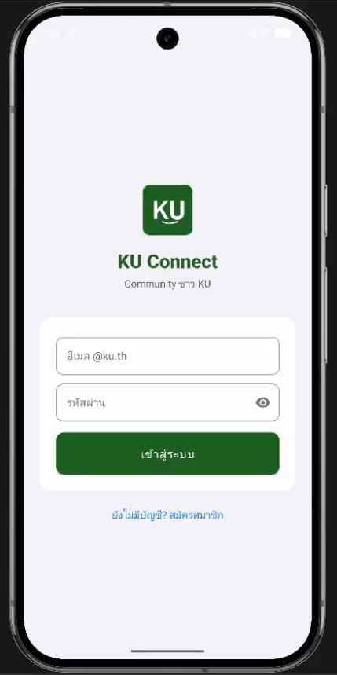
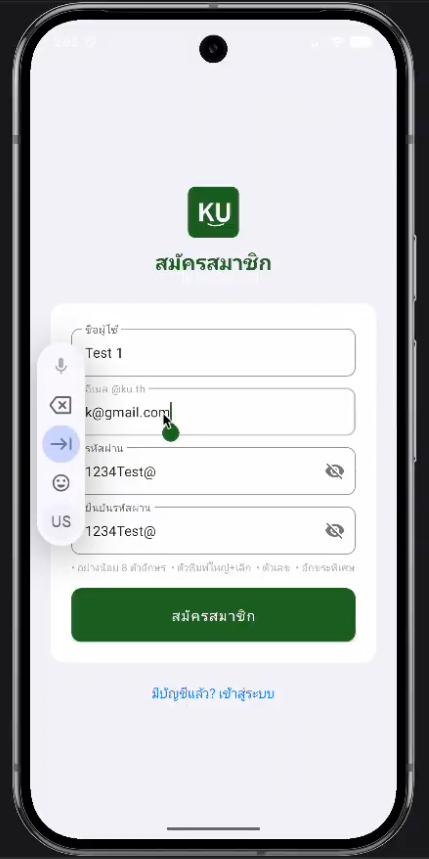
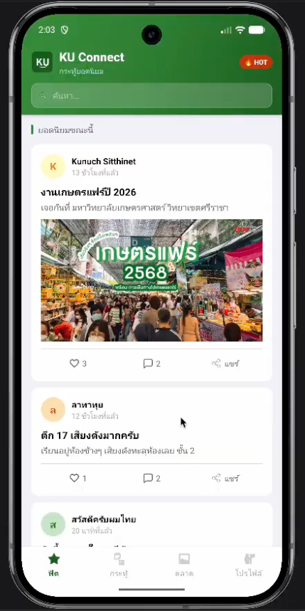
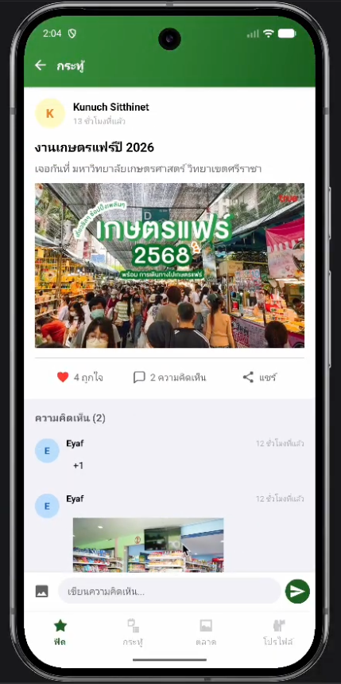
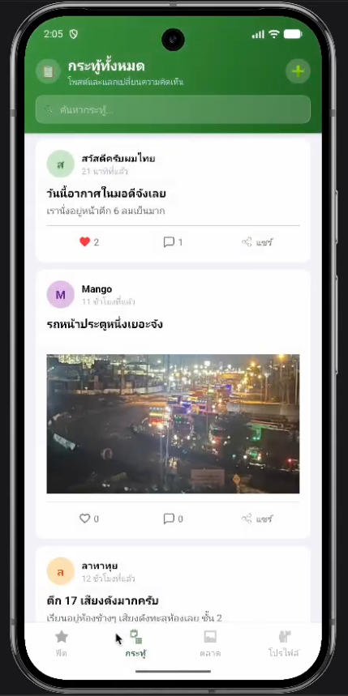
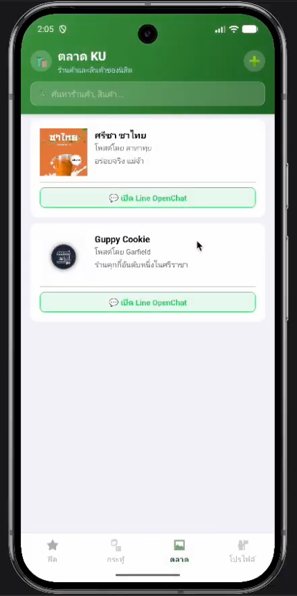
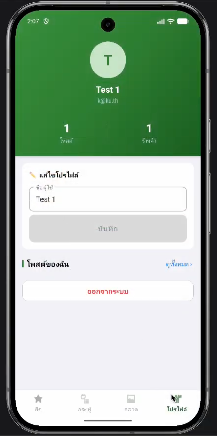

# 📱 Project - KU Connect Community App (Kotlin Android)

> Project แอปพลิเคชัน Android สำหรับนิสิต ใช้สำหรับสื่อสาร แบ่งปันโพสต์ และพื้นที่ขายของ ภายใต้ระบบไม่ระบุตัวตน (@ku.th)

## 🛠️ Features
- **ระบบยืนยันตัวตนผู้ใช้ (Authentication System)**: ผู้ใช้สามารถสมัครสมาชิกและเข้าสู่ระบบด้วยอีเมล @ku.th เท่านั้น เพื่อจำกัดการใช้งานเฉพาะนิสิตและเพิ่มความน่าเชื่อถือของแพลตฟอร์ม
- **ระบบโปรไฟล์แบบไม่ระบุตัวตน (Anonymous Profile System)**: ผู้ใช้สามารถตั้งค่าและแก้ไขโปรไฟล์ได้อย่างอิสระ โดยการเปลี่ยนแปลงโปรไฟล์จะไม่ส่งผลต่อโพสต์ที่เคยสร้างไว้ ช่วยเพิ่มความเป็นส่วนตัวและลดการระบุตัวตน
- **ระบบฟีดโพสต์ (Social Feed System)**: ผู้ใช้สามารถสร้าง ดู และมีปฏิสัมพันธ์กับโพสต์ในระบบได้ โดยรองรับทั้งข้อความและรูปภาพ เพื่อการสื่อสารและแชร์ข้อมูลภายในชุมชน
- **ระบบ Marketplace (Marketplace System)**: นิสิตสามารถสร้างร้านค้าของตนเอง เพิ่มข้อมูลสินค้า และอัปโหลดรูปภาพสินค้า เพื่อใช้เป็นพื้นที่ซื้อขายภายในชุมชน

## 🚀 Screenshots

<p align="center">
  
</p>

<p align="center">
  
</p>

<p align="center">
  
</p>

<p align="center">
  
</p>

<p align="center">
  
</p>

<p align="center">
  
</p>

<p align="center">
  
</p>

## 📜 License

This project is open-source under the MIT License. Let me know if you need any modifications! 🚀

## 🗺️ Project Structure

```bash
ku-connect-community-app-kotlin/
├── LICENSE                    # Project license (MIT)
├── README.md                  # Project documentation (important for portfolio)
├── build.gradle.kts           
├── settings.gradle.kts       
├── gradle.properties          
├── gradlew / gradlew.bat      
├── .gitignore                 
├── .idea/                     
│   └── ...                    
├── app/                       
│   ├── build.gradle.kts      
│   ├── google-services.json   # Firebase configuration (Auth, Firestore, Storage)
│   ├── proguard-rules.pro    
│   └── src/
│       ├── androidTest/       
│       ├── test/              
│       └── main/              
│           ├── AndroidManifest.xml   # App configuration (activities, permissions)
│           ├── java/com/example/ku_connect/
│           │   ├── data/             # Data layer (models, repositories, DB/Firebase logic)
│           │   ├── service/          # External services (API calls, chat, image upload)
│           │   ├── viewmodel/        # MVVM ViewModels (business logic, state management)
│           │   ├── ui/               # UI layer (Activities, Fragments, Adapters)
│           │   ├── util/             # Utility classes, constants, helper functions
│           │   └── KuConnectApp.kt   # Application class (app-level initialization)
│           └── res/
│               ├── layout/           # XML UI layouts (screens)
│               ├── drawable/         # Images, icons, shapes
│               ├── navigation/       # Navigation graph (screen flow)
│               ├── menu/             # Menu resources (toolbar, bottom navigation)
│               ├── values/           # colors.xml, strings.xml, themes.xml
│               ├── anim/             # Animations
│               └── .../              # Other resources
├── gradle/
│   ├── libs.versions.toml   
│   └── wrapper/                             
```

## ⚙️ Installation 
To run this Project:

```bash
git clone https://github.com/zChuckyX/ku-connect-community-app-kotlin.git
```
```bash
cd ku-connect-community-app-kotlin
```
```bash
open with Android Studio
```
